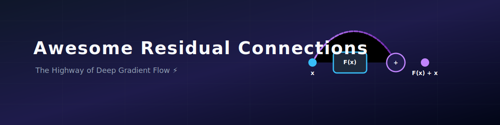
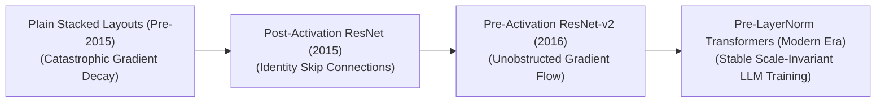
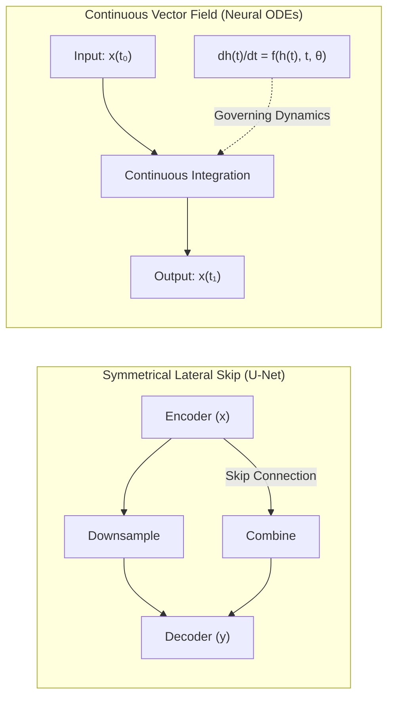

  

# 🚀 Awesome-Residual-Connections
## ⛓️ Residual Connections: History, Progression, Variants, & Applications

  
  
  

A **Residual Connection**—alternatively designated as a shortcut connection, skip connection, or identity mapping—is a foundational architectural component in deep learning that bypasses one or more layers in a neural network graph to perform an elemental addition operation [INDEX: 1]. Originally conceptualized by Kaiming He, Xiangyu Zhang, Shaoqing Ren, and Jian Sun in 2015 ("Deep Residual Learning for Image Recognition"), residual connections provided the definitive mathematical resolution to the catastrophic **vanishing and exploding gradient problems** that placed an absolute ceiling on the depth of deep neural networks [INDEX: 1]. 

Prior to this structural breakthrough, stacking layers past a depth of ~20 caused backpropagated error signals to decay exponentially as they traveled through sequential matrices, stalling optimization [INDEX: 1]. By hardwiring an unobstructed, non-parameterized linear identity highway ($y = F(x) + x$), residual connections allow error gradients to flow backward through infinite computational depths completely unaltered, unlocking the stable training of models containing hundreds of layers, and serving as a mandatory structural building block for modern Vision Learners and Large Language Models [INDEX: 1].

---

## ⏳ 1. The Macro Chronological Evolution

The implementation of residual shortcut mapping has transitioned from plain sequential feeds to linear identity shifts, unblocked pre-activations, and multi-node transformer-fused scaling parameters.

| Era / Concept | Description | First Used (Year) | First Used Paper |
| :--- | :--- | :--- | :--- |
| **[The Plain Sequential Era (Traditional ConvNets, Pre-2015)](./details/plain_sequential_era.md)** | **Concept:** The early convolutional baseline (e.g., VGG, AlexNet). Networks were scaled up by simply stacking matrix projection layers one after another.  **Limitation:** The **Deep Degradation Problem**. As depth expanded, training accuracy saturated and then degraded rapidly. This was not caused by overfitting (as training error rose alongside validation error), but by the physical inability of standard gradient descent algorithms to route numerical updates back through dense stacks of highly non-linear transformations. | 2012 | [ImageNet Classification with Deep Convolutional Neural Networks (Krizhevsky et al., 2012)](https://proceedings.neurips.cc/paper/2012/file/c3988bc9dd14eb0ec6957cc8bab9d48b-Paper.pdf) |
| **[The Post-Activation Identity Revolution (Vanilla ResNet, 2015)](./details/post_activation_identity.md)** | **Concept:** The watershed moment that dismantled the depth wall. Instead of forcing a block of stacked layers to fit an absolute underlying target mapping $H(x)$, the block was structurally forced to approximate a residual mapping: $F(x) = H(x) - x$. The original, unaltered input $x$ is appended straight to the output via a non-parameterized identity shortcut loop, executing an element-wise summation: $y = F(x) + x$.  **Limitation:** In this early setup, the identity highway was still slightly obstructed because the addition operation was followed by a non-linear Activation function (ReLU) and a Batch Normalization layer, slightly warping gradient trajectories across deep paths. | 2015 | [Deep Residual Learning for Image Recognition (He et al., 2015)](https://arxiv.org/abs/1512.03385) |
| **[The Pre-Activation & Unobstructed Pathway Era (ResNet-v2, 2016)](./details/pre_activation_pathway.md)** | **Concept:** Perfected the mathematical formulation of identity mapping. He et al. rearranged the internal structural block sequence, moving the Batch Normalization and ReLU layers *before* the convolutional weight matrix calculations (Pre-Activation).  **Significance:** Made the residual shortcut a completely clean, unobstructed clean highway. Gradients could now flow backward from the final terminal layer straight to the earliest input step zero without encountering any non-linear dampening, unlocking stable convergence for models exceeding 1,000+ layers. | 2016 | [Identity Mappings in Deep Residual Networks (He et al., 2016)](https://arxiv.org/abs/1603.05027) |
| **[The Pre-LayerNorm Transformer Scaling Era (~2020–Present)](./details/pre_layernorm_transformer.md)** | **Concept:** The modern state-of-the-art foundation baseline. Residual connections shifted from vision backbones straight into the core processing architecture of modern LLMs (e.g., Llama 3, DeepSeek-V3). To stabilize distributed cluster training loops over trillions of tokens, architectures standardized **Pre-Layer Normalization (Pre-LN)**. The residual shortcut wraps around the multi-head self-attention and MLP blocks, keeping the main identity trunk completely un-normalized while normalizations occur solely on the parallel sub-paths. | 2020 | [On Layer Normalization in the Transformer Architecture (Xiong et al., 2020)](https://arxiv.org/abs/2002.04745) |

---

## 🧬 2. Core Functional & Structural Variants

Residual connections are categorized based on how the shortcut maps input feature layouts and dimensions across different tensor spaces.

| Variant | Mechanism / Details | First Used (Year) | First Used Paper |
| :--- | :--- | :--- | :--- |
| **[A. Linear Identity Shortcuts (Non-Parameterized Mapping)](./details/linear_identity_shortcuts.md)** | **Mechanism:** The absolute purest formulation. The shortcut vector is a direct copy of the input tensor, requiring zero learnable parameters: $y = F(x) + x$.  **Condition:** Requires the spatial dimensions and channel width of the input $x$ to match the output dimension of the weight block $F(x)$ exactly. | 2015 | [Deep Residual Learning for Image Recognition (He et al., 2015)](https://arxiv.org/abs/1512.03385) |
| **[B. Projection Residual Shortcuts (Parameterized Downsampling)](./details/projection_residual_shortcuts.md)** | **Mechanism:** Enforced when an architecture downsizes its spatial canvas or doubles its channel depth (e.g., moving between transition blocks in a ResNet). The shortcut inserts a learnable linear projection matrix ($W_s$)—typically a $1 \times 1$ convolution with a stride of 2—to mathematically morph the dimensions of $x$ to match the main path before addition: $$y = F(x) + W_s x$$ | 2015 | [Deep Residual Learning for Image Recognition (He et al., 2015)](https://arxiv.org/abs/1512.03385) |
| **[C. Gated Residual Connections (Stochastic Depth / Highway Networks)](./details/gated_residual_connections.md)** | **Mechanism:** Preceded and informed standard ResNets. It adds a learnable gating parameter ($\mathbf{T}$) to dynamically scale the influence of the identity pass: $y = F(x) \cdot \mathbf{T}(x) + x \cdot (1 - \mathbf{T}(x))$.  **Downstream Application:** Modernized into **Stochastic Depth training schedules**, randomly dropping full residual blocks entirely during training epochs to regularize parameters while keeping the identity trunk intact. | 2015 | [Highway Networks (Srivastava et al., 2015)](https://arxiv.org/abs/1505.00387) |
| **[D. Pre-LN vs. Post-LN Transformer Paths](./details/pre_ln_vs_post_ln.md)** | **Post-LN (Classic Transformer):** $\text{Layer}(x) = \text{LayerNorm}(x + \text{SubLayer}(x))$. This layout requires meticulous learning rate warmup tuning, as gradients near the output layer explode relative to early blocks.  **Pre-LN (Modern Production LLM):** $\text{Layer}(x) = x + \text{SubLayer}(\text{LayerNorm}(x))$. This structure stabilizes optimization, allowing massive multi-node training runs to initiate safely at maximum learning rate velocity without warmup delays. | 2017 (Post-LN) / 2020 (Pre-LN) | [Attention Is All You Need (Vaswani et al., 2017)](https://arxiv.org/abs/1706.03762) / [On Layer Normalization in the Transformer Architecture (Xiong et al., 2020)](https://arxiv.org/abs/2002.04745) |

---

## 🕸️ 3. Deep Topology Extensions & Generalizations

The mathematical properties discovered via residual skip connections have expanded into cross-layer density networks and continuous differential systems.

| Topology / Extension | Profile / Details | First Used (Year) | First Used Paper |
| :--- | :--- | :--- | :--- |
| **[Symmetrical Lateral Skip Connections (U-Net Topology)](./details/symmetrical_lateral_skip.md)** | **Profile:** High-Resolution Spatial Preservation. Deployed heavily in dense pixel semantic segmentation and generative diffusion denoising blocks. Symmetrical residual skip bridges copy crisp, high-frequency boundary details straight from early encoder stages and fuse them onto terminal decoding layers, preventing spatial information loss. | 2015 | [U-Net: Convolutional Networks for Biomedical Image Segmentation (Ronneberger et al., 2015)](https://arxiv.org/abs/1505.04597) |
| **[Dense Cross-Layer Connections (DenseNet Class)](./details/dense_cross_layer.md)** | **Profile:** Feature-Accumulation Networks. Instead of summing up the features ($F(x) + x$), DenseNet *concatenates* all historical layer maps together: $y = [x, F_1(x), F_2(x, F_1(x))]$. This forces deep layers to have direct, raw access to early input metrics, maximizing feature reuse. | 2016 | [Densely Connected Convolutional Networks (Huang et al., 2016)](https://arxiv.org/abs/1608.06993) |
| **[Continuous-Time Infinitesimal Scaling (Neural ODEs)](./details/continuous_time_infinitesimal.md)** | **Profile:** Mathematical continuous fields. Proves theoretically that as residual layer adjustments become infinitely thin and step horizons approach infinity, a standard ResNet maps out a continuous ordinary differential equation (ODE) vector trajectory: $$\frac{dh(t)}{dt} = f(h(t), t, \theta)$$ | 2018 | [Neural Ordinary Differential Equations (Chen et al., 2018)](https://arxiv.org/abs/1806.07366) |

---

## ⚙️ 4. Production Engineering Challenges & Hardware Solutions

Implementing and scaling residual computations across modern hardware configurations introduces unique caching bottlenecks and tensor core synchronization boundaries.

| Challenge | Problem & Mitigation | First Used (Year) | First Used Paper |
| :--- | :--- | :--- | :--- |
| **[The Activation Memory Wall (HBM Allocation Crisis)](./details/activation_memory_wall.md)** | **The Problem:** Storing the intermediate feature maps for every individual convolutional layer across a 152-layer ResNet during training loops generates a massive multi-gigabyte memory footprint. This saturates GPU High Bandwidth Memory (HBM), triggering Out-of-Memory (OOM) crashes.  **Mitigation:** Implementing **Selective Activation Checkpointing**, which discards intermediate activation tensors immediately after forward execution, rematerializing them on-the-fly inside fast GPU registers only when the backward residual loop requires them. | 2016 | [Training Deep Nets with Sublinear Memory Cost (Chen et al., 2016)](https://arxiv.org/abs/1604.06174) |
| **[The Unstructured Channel-Padding Core Stall](./details/unstructured_channel_padding.md)** | **The Problem:** When executing projection shortcuts to adjust channel depths, using unoptimized zero-padding or misaligned strides forces the hardware to compute fragmented, non-contiguous matrix reads, stalling the GPU’s parallel Tensor Cores.  **Mitigation:** Compiling transformation layers into **Fused Triton or CUDA Kernels** that compute the downsampling stride and channel up-projection within a single unified memory block inside GPU SRAM. | 2019 | [Triton: An Intermediate Language and Compiler for Tiled Neural Network Computations (Tillet et al., 2019)](https://www.eecs.harvard.edu/~htk/publication/2019-mapl-tillet-kung-cox.pdf) |

---

## 🌐 5. Frontier Real-World AI Applications

| Application | Details | First Used (Year) | First Used Paper |
| :--- | :--- | :--- | :--- |
| **[Pre-Training Trillion-Token Foundational LLM Backbones](./details/trillion_token_llm.md)** | Acts as the mandatory stabilization architecture underpining massive base models (e.g., Llama 3, DeepSeek-V3). Pre-LN residual connections wrap around multi-head self-attention and sparse Mixture-of-Experts (MoE) blocks, allowing gradient trajectories to remain scale-invariant over tens of trillions of tokens. | 2020 | [Language Models are Few-Shot Learners (Brown et al., 2020)](https://arxiv.org/abs/2005.14165) |
| **[Autonomous Vehicle Multimodal BEV Perception Networks](./details/autonomous_vehicle_perception.md)** | Ingests real-time streaming high-res camera video and LiDAR 3D coordinates concurrently. Deep ResNet or ConvNeXt feature-extraction backbones process pixels through dense residual blocks, mapping features stably into 3D Bird's-Eye-View (BEV) grids to execute precise obstacle tracking safely. | 2022 | [BEVFormer: Learning Bird's-Eye-View Representation from Multi-Camera Images via Spatiotemporal Transformers (Li et al., 2022)](https://arxiv.org/abs/2203.17270) |
| **[High-Resolution Clinical Volumetric Diagnostic Tracking](./details/clinical_volumetric_diagnostic.md)** | Processes massive multi-megapixel medical scans (such as MRIs, CT volumes, and digital pathology slides). Symmetrical residual encoder-decoder graphs (U-Net variants) automate pixel-level tumor tracking, helping radiologists isolate pathologically dangerous boundaries with sub-millimeter precision. | 2015 | [U-Net: Convolutional Networks for Biomedical Image Segmentation (Ronneberger et al., 2015)](https://arxiv.org/abs/1505.04597) |

---
## 📚 References

1. Srivastava, R. K., Greff, K., & Schmidhuber, J. (2015). Highway networks. *arXiv preprint arXiv:1505.00387*.
2. He, K., Zhang, X., Ren, S., & Sun, J. (2016). Deep residual learning for image recognition. *Proceedings of the IEEE Conference on Computer Vision and Pattern Recognition (CVPR)*, 770-778 [INDEX: 1].
3. He, K., Zhang, X., Ren, S., & Sun, J. (2016). Identity mappings in deep residual networks. *European Conference on Computer Vision (ECCV)*, 630-645 [INDEX: 1].
4. Huang, G., et al. (2017). Densely connected convolutional networks. *Proceedings of the IEEE Conference on Computer Vision and Pattern Recognition (CVPR)*.
5. Chen, R. T., et al. (2018). Neural ordinary differential equations. *Advances in Neural Information Processing Systems (NeurIPS)*, 31.
6. Liu, Z., et al. (2022). A convnet for the 20s. *Proceedings of the IEEE/CVF Conference on Computer Vision and Pattern Recognition (CVPR)* [INDEX: 1].

---

To advance this documentation repository, structural setup, or post-training pipeline, consider exploring these adjacent development pathways:
* Build a **Python code snippet using PyTorch** illustrating how to write a custom Pre-Activation Bottleneck Residual Block module featuring a projection shortcut path from scratch [INDEX: 1].
* Generate a **comprehensive Markdown table** explicitly comparing Basic ResNet Blocks, Bottleneck Blocks, Pre-Activation Blocks, and DenseNet Concatenation across computational complexities, parameter footprint changes, VRAM serving requirements, and gradient flow properties [INDEX: 1].
* Establish a **performance profiling notebook using Triton** to track the exact computational throughput, communication-to-computation overlap ratios, and VRAM memory saving bounds achieved when shifting a distributed training run from Post-LN to Pre-LN Transformer configurations.

***

**Proactive Repository Follow-Ups:**

To assist with your documentation repository setup, let me know how you would like to proceed by choosing one of the options below:
* I can provide a **complete Python code boilerplate using PyTorch** demonstrating how to write an automated script that applies a custom residual bottleneck layer to a dense visual matrix [INDEX: 1].
* I can generate a **Markdown matrix table** tracking the explicit layer depth configurations, block ratios, and normalization channels used by leading foundational transformers.
* I can write a detailed technical explanation focusing on the **mathematical proof of gradient propagation bounds** ($d\mathcal{E}/dx$) inside an unobstructed Pre-Activation identity trunk [INDEX: 1].

