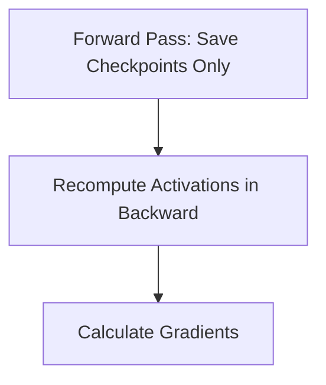

# The Activation Memory Wall

## Concept Diagram

## Detailed Information

Training deep models requires substantial GPU VRAM to store intermediate activations for backpropagation. Gradient checkpointing mitigates this by keeping only specific check-pointed activations and recomputing the rest during the backward pass.

---
[Back to README](../README.md)
