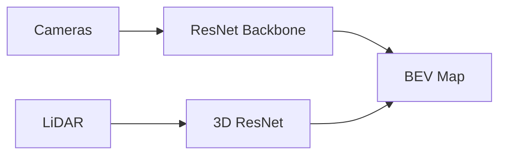

# Autonomous Vehicle Multimodal BEV Perception Networks

## Concept Diagram

## Detailed Information

In autonomous driving, ResNet/ConvNeXt backbones extract features from camera/LiDAR streams. Skip connections retain low-level spatial geometry and high-level semantics, fusing them into a unified 3D Bird's-Eye-View (BEV) map.

---
[Back to README](../README.md)
