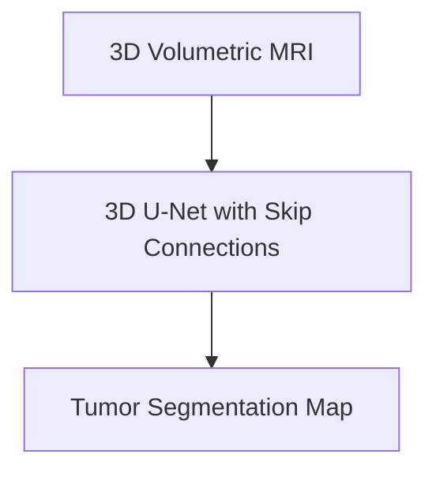

# High-Resolution Clinical Volumetric Diagnostic Tracking

## Concept Diagram

## Detailed Information

Medical image segmentation models (like U-Net) process 3D medical scans. Symmetrical encoder-decoder skip connections retain sharp boundaries, helping radiologists segment tumors with sub-millimeter precision.

---
[Back to README](../README.md)
