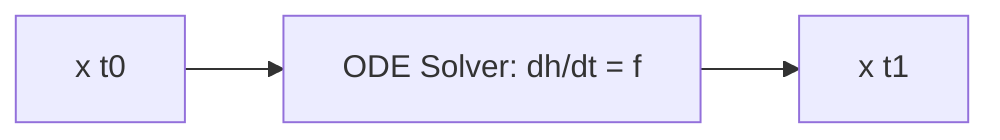

# Continuous-Time Infinitesimal Scaling (Neural ODEs)

## Concept Diagram

## Detailed Information

Neural Ordinary Differential Equations (Neural ODEs) generalize deep residual networks to a continuous state space. A ResNet can be interpreted as a discretization of an ODE, allowing for adaptive step-size integration.

---
[Back to README](../README.md)
