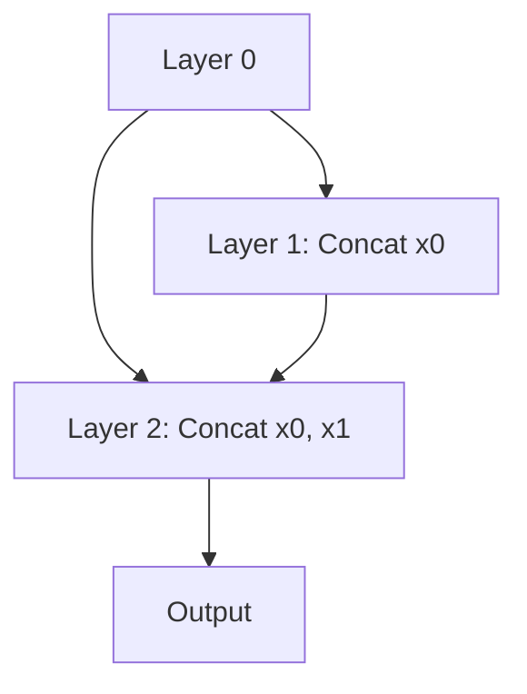

# Dense Cross-Layer Connections

## Concept Diagram

## Detailed Information

DenseNet replaces summation with concatenation. Each layer obtains inputs from all preceding layers and passes its own feature maps to all subsequent layers: y = [x_0, x_1, x_2, ...].

---
[Back to README](../README.md)
