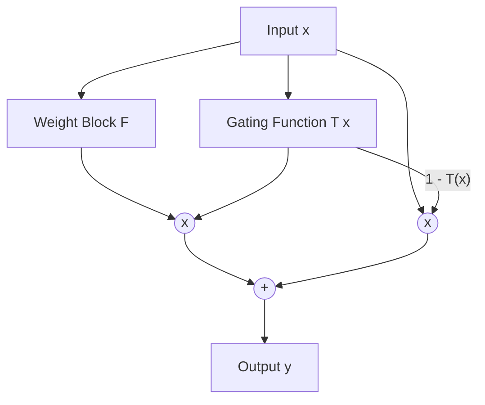

# Gated Residual Connections

## Concept Diagram

## Detailed Information

In Highway Networks (2015), the flow of information through the shortcut is dynamically controlled using learnable gating units: y = F(x) * T(x) + x * (1 - T(x)).

---
[Back to README](../README.md)
