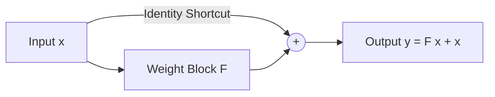

# Linear Identity Shortcuts

## Concept Diagram

## Detailed Information

The purest form of skip connection where the input is added directly to the output of the residual block without any parameterized projection or scaling: y = F(x) + x.

---
[Back to README](../README.md)
