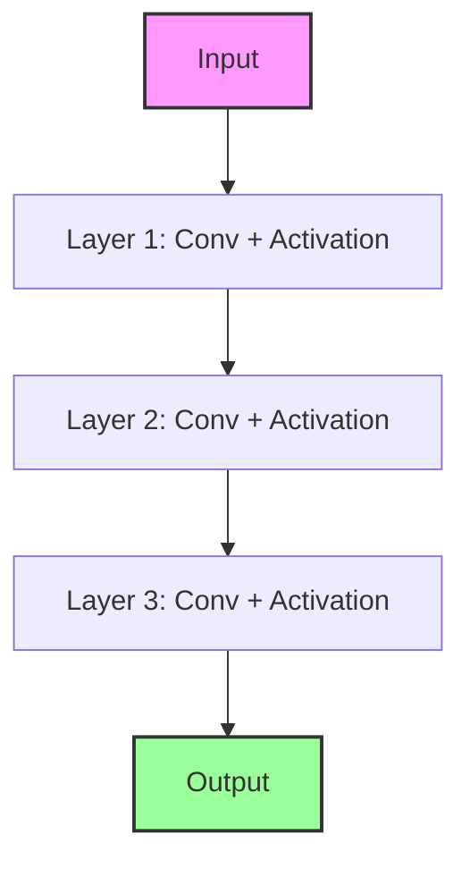

# The Plain Sequential Era

## Concept Diagram

## Detailed Information

Before 2015, convolutional neural networks (such as AlexNet and VGG) were designed by stacking layer upon layer sequentially. As networks grew deeper, they suffered from the vanishing/exploding gradient problem, causing training degradation where accuracy saturated and then declined rapidly.

---
[Back to README](../README.md)
