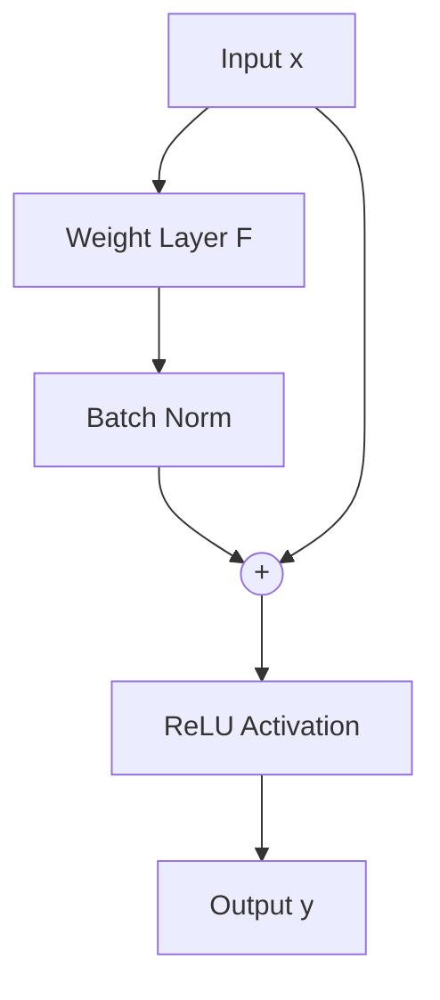

# Post-Activation Identity Revolution

## Concept Diagram

## Detailed Information

Introduced in the original ResNet paper (2015), the post-activation residual connection adds the input tensor directly to the output of the weight layer (with Batch Norm) before applying the final ReLU activation function: y = ReLU(F(x) + x).

---
[Back to README](../README.md)
