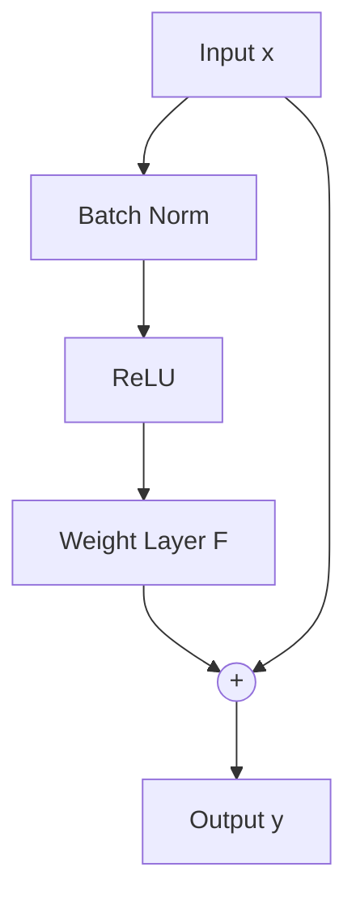

# Pre-Activation & Unobstructed Pathway Era

## Concept Diagram

## Detailed Information

ResNet-v2 (2016) proposed Pre-Activation, where Batch Normalization and ReLU are applied before the weight layers. This creates an unobstructed identity highway, allowing gradients to flow backward from the last layer to the first without passing through non-linear operations.

---
[Back to README](../README.md)
