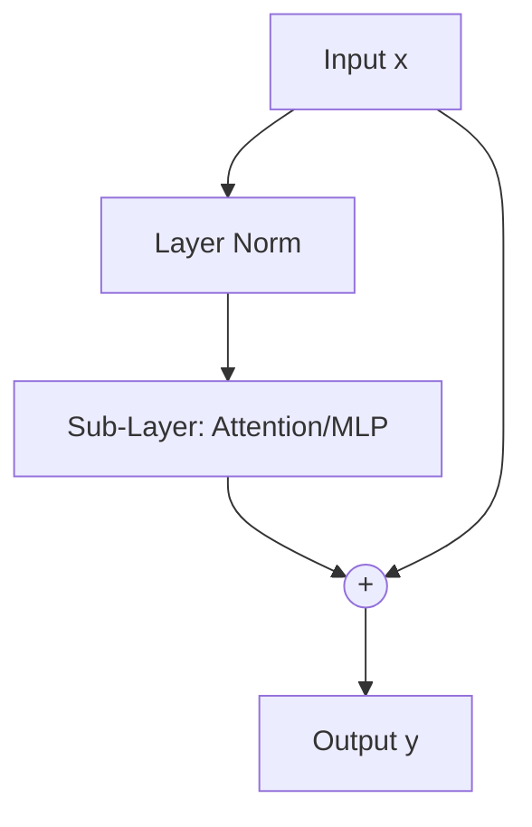

# Pre-LayerNorm Transformer Scaling Era

## Concept Diagram

## Detailed Information

Modern Large Language Models standardize on the Pre-LayerNorm (Pre-LN) configuration. Normalization is applied at the input of each sub-layer (attention and feed-forward networks), preserving the main identity path completely un-normalized for stable training scale-invariance.

---
[Back to README](../README.md)
