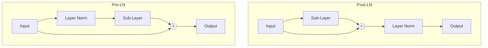

# Pre-LN vs. Post-LN Transformer Paths

## Concept Diagram

## Detailed Information

Post-LN places normalization after the residual addition, which requires warmup schedules because gradient norms near output layers are significantly larger. Pre-LN places normalization before the sub-layers, stabilizing training and eliminating warmup needs.

---
[Back to README](../README.md)
