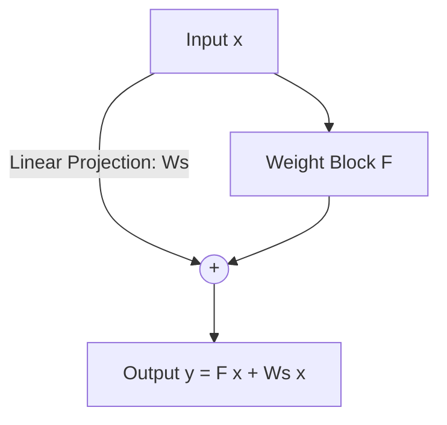

# Projection Residual Shortcuts

## Concept Diagram

## Detailed Information

When spatial dimensions downsample or channel depths change, a linear projection (typically a 1x1 convolution with stride > 1) is applied to match dimensions: y = F(x) + W_s(x).

---
[Back to README](../README.md)
