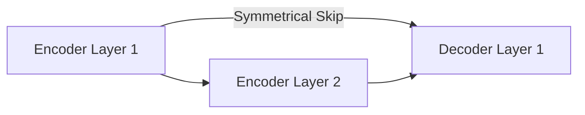

# Symmetrical Lateral Skip Connections (U-Net)

## Concept Diagram

## Detailed Information

Common in image segmentation (e.g., U-Net), these skip connections copy high-resolution spatial feature maps from the encoder side directly to the decoder side, preserving fine details that would otherwise be lost during downsampling.

---
[Back to README](../README.md)
