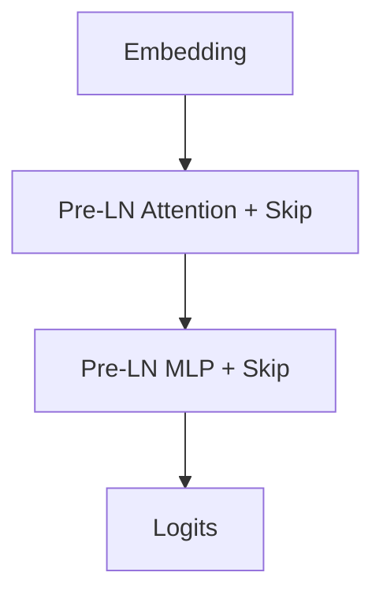

# Pre-Training Trillion-Token Foundational LLM Backbones

## Concept Diagram

## Detailed Information

Modern LLMs rely heavily on stable Pre-LN residual connections wrapping Self-Attention and Mixture-of-Experts (MoE) layers to ensure scale-invariant gradients and prevent training instability across trillions of tokens.

---
[Back to README](../README.md)
