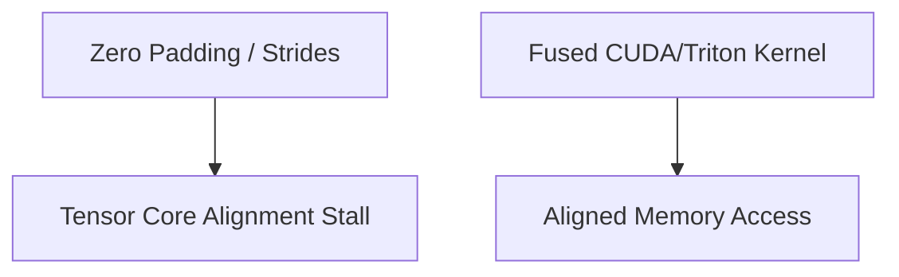

# The Unstructured Channel-Padding Core Stall

## Concept Diagram

## Detailed Information

Unfused projection layers can cause memory stalls due to non-contiguous matrix layouts on Tensor Cores. Custom fused Triton or CUDA kernels optimize these operations into unified memory accesses.

---
[Back to README](../README.md)
